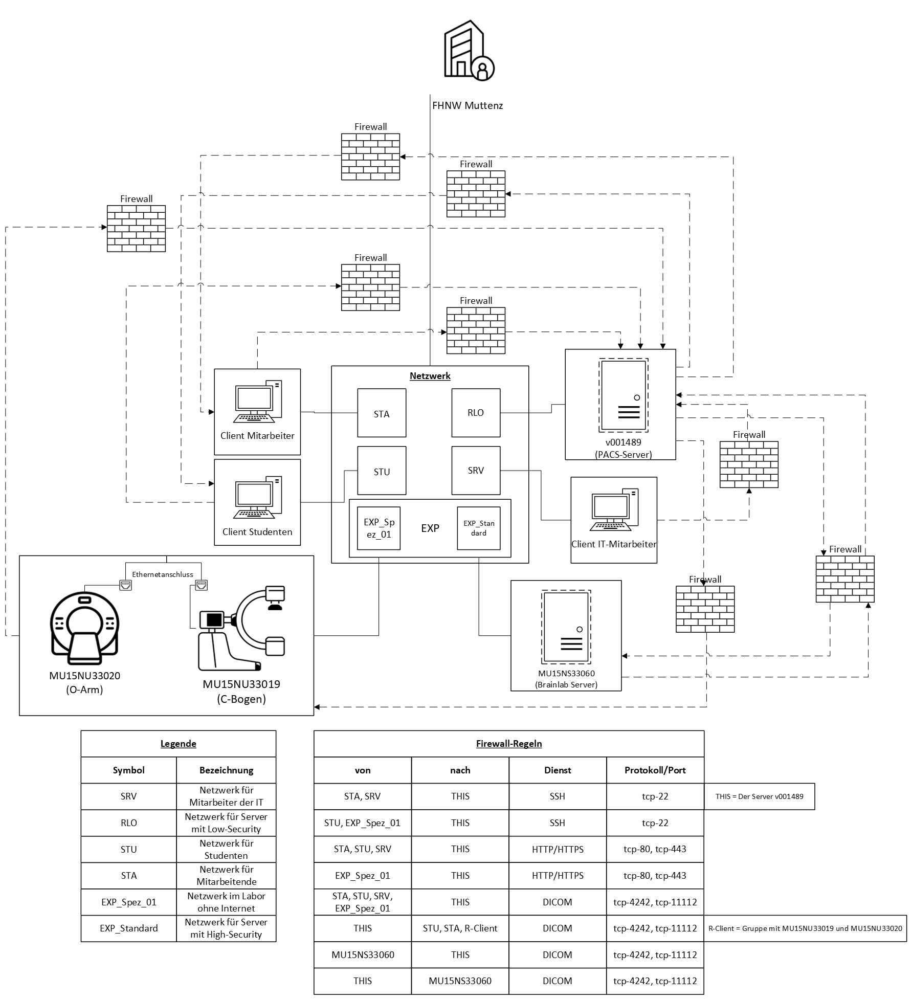

# **PACS DICOM Viewer Projekt**

Dieses Projekt bietet eine Anleitung zur Installation, Konfiguration und Nutzung eines PACS DICOM Viewers, einschließlich der Integration eines CT-Scanners und des Weasis DICOM Viewers. Es beinhaltet zudem ein Troubleshooting-Dokument sowie alle relevanten Konfigurationsdateien.

## **Inhalt**

- [Einleitung](#einleitung)
- [Diagramm](#diagramm)
- [Anleitung](#anleitung)
- [Troubleshooting](#troubleshooting)
- [Wichtige Dateien](#wichtige-dateien)
- [Voraussetzungen](#voraussetzungen)
---

## **Einleitung**

Dieses Projekt richtet sich an IT-Administratoren, die Orthanc PACS zur Verwaltung von DICOM-Daten installieren und konfigurieren möchten. Es umfasst:

- **Eine vollständige Anleitung** zur Installation und Einrichtung.
- **Ein Troubleshooting-Dokument** zur Fehlerbehebung.
- **Alle notwendigen Konfigurationsdateien** (z. B. `.ini`, `.yml`, `.json`).

Das Ziel ist es, eine nahtlose Installation und Nutzung des PACS DICOM Viewers sicherzustellen.

---

## **Diagramm**

Das folgende Diagramm zeigt die Architektur und die Verbindung zwischen den Komponenten:

---

## **Anleitung**

Die vollständige Anleitung zur Installation und Konfiguration finden Sie in der Datei [INSTALLATION.md](docs/INSTALLATION.md). Diese Datei enthält:

1. Schritte zur Installation von Ansible.
2. Erstellung und Nutzung von Playbooks.
3. Konfiguration von Orthanc und Weasis.
4. Einbindung eines CT-Scanners.

---

## **Troubleshooting**

Falls während der Installation oder Nutzung Probleme auftreten, bietet das Troubleshooting-Dokument [TROUBLESHOOTING.md](docs/TROUBLESHOOTING.md) umfassende Hilfe zu:

- Ansible Playbook-Problemen.
- Problemen bei der Orthanc-Installation.
- Konfigurationsfehlern.
- Verbindungsschwierigkeiten mit Weasis DICOM Viewer.

---

## **Wichtige Dateien**

| Dateiname                                                                                           | Beschreibung                                         |
|-----------------------------------------------------------------------------------------------------|------------------------------------------------------|
| [DOCUMENTATION.md](docs/DOCUMENTATION.md)                                                           | Dokumentation des Projektes                          |
| [INSTALLATION.md](docs/INSTALLATION.md)                                                             | Anleitung zur Installation und Konfiguration.        |
| [TROUBLESHOOTING.md](docs/TROUBLESHOOTING.md)                                                       | Dokument zur Fehlerbehandlung.                       |
| [netzwerkarchitektur_pacs_system.pdf](docs/netzwerkarchitektur/netzwerkarchitektur_pacs_system.pdf) | Diagramm der Projektarchitektur.                     |
| [inventory.ini](ansible/inventory.ini)                                                              | Enthält die Konfigurationsdetails der Managed Nodes. |
| [install_orthanc.yml](ansible/install_orthanc.yml)                                                  | Playbook zur Installation von Orthanc PACS.          |
| [uninstall_orthanc.yml](ansible/uninstall_orthanc.yml)                                              | Optionales Playbook zur Deinstallation von Orthanc.  |
| [orthanc.json](ansible/files/orthanc.json)                                                          | Hauptkonfigurationsdatei für Orthanc.                |
| [credentials.json](ansible/files/credentials.json)                                                  | Zugangsdaten für Orthanc.                            |
| [dicomweb.json](ansible/files/dicomweb.json)                                                        | Konfiguration für DICOMWeb.                          |

---

## **Voraussetzungen**

### **Hardware**
- Ein Server mit dem Betriebssystem Debian 12 oder Ubuntu 24.04 zur Ausführung des Playbooks.

### **Software**
- **Betriebssystem:** Ubuntu oder vergleichbar.
- **Ansible:** Zur Automatisierung der Installation.
- **Weasis:** Für die Visualisierung der DICOM-Daten.

### **Zugang**
- Administratorrechte auf den Servern.
- Netzwerkzugang zwischen den Komponenten (PACS, CT-Scanner, Weasis).

